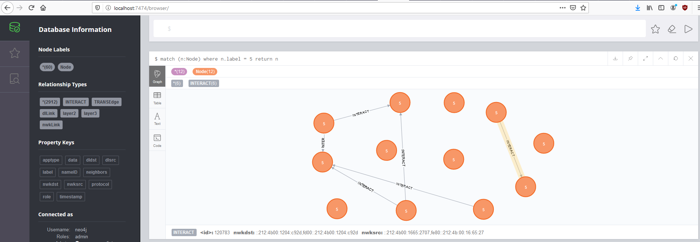

# IoTMap
IoTMap is a tool that models IoT networks using one or multiple protocols simultaneously. 
This is work in progress, as a part of a PhD thesis on Internet Of Things security.
This repository is regularly updated as new results are obtained.
This project supports 3 protocol as this time : BLE, ZigBee and OS4I. More are coming.

## Requirements :

### Python 3 requirements

* Python > 3.5
* Scapy (Can be installed through the requirements file but building the from the [latest source](https://github.com/secdev/scapy) is recommended)
* neo4j-1.7.6
* docopt-0.6.2
* prompt-toolkit-3.0.5
* terminaltables-3.1.0
* pycryptodomex-3.9.7

You can use the requirements.txt file to install the packages:
```
pip3 install -r requirements.txt
```

### OS libraries

* libgcrypt20-dev (Needed for sniffing capabilities through KillerBee)
Depending on the system you used (debian-based OS, archlinux-based OS) you can
use:
```
sudo apt-get install libgcrypt20-dev # (debian-based distribs)
sudo pacman -S libgcrypt             # (archlinux-based distribs)
```

## Installation

Clone this repo and install all requirements described above:
```
# For any distrib
git clone https://github.com/AlgoSecure/iotmap.git
cd iotmap
sudo pip install -r requirements.txt

# If debian-based
sudo apt-get install libgcrypt20-dev

# If archlinux-based
sudo pacman -S libgcrypt
```

Now we gonna install Neo4J. Most distributions ships Neo4J through the built-in package manager. However, it may be simpler 
to install and use it from the tarball:
```
cd /path/to/iotmap
cd database

# Replace the version number with the latest in the URL if necessary
wget -O neo4j-community.tar "https://neo4j.com/artifact.php?name=neo4j-community-3.5.9-unix.tar.gz"
mkdir neo4j-community && tar xvf neo4j-community.tar -C neo4j-community --strip-components 1
```

## First run

For the first run of the project, you need to define a username and a password for
the database. Start the database with the following:
```
cd database
./neo4j-community/bin/neo4j console
```

Neo4J will start and is accessible at http://localhost:7474. Default username and
password are `neo4j` and `neo4j` respectively. 
Iotmap uses the default username and `iotmap` for password. 

If you want to set different credentials, you must update the values in 
`core/databaseController.py` at line 46 as follows:
```
model = Model("bolt:http://localhost:7474", "username", "password")
```

## How to use iotmap

A more detailed documentation on how to use IoTMap with an example is available [here](doc/started.md)

Start the framework:
 ```
python3 iotmap.py
``` 
IoTMap will start the neo4j database before running, 
however the database is not immediately available. 
Sometimes the sleep of 10 seconds is enough for the database to be available, sometimes not and you need to rerun iotmap. 

IoTMap provides 3 modules: **Database, Modelling and Sniffing**. 
The sniffing module is a work in progress and not fully operational. 
To switch between modules, simply type the name of the module.

````
python3 iotmap.py
Starting the database
Database is available at http://localhost:7474/


IIIIIIIIII              TTTTTTTTTTTTTTTTTTTTTTTMMMMMMMM               MMMMMMMM
I::::::::I              T:::::::::::::::::::::TM:::::::M             M:::::::M
I::::::::I              T:::::::::::::::::::::TM::::::::M           M::::::::M
II::::::II              T:::::TT:::::::TT:::::TM:::::::::M         M:::::::::M
  I::::I     oooooooooooTTTTTT  T:::::T  TTTTTTM::::::::::M       M::::::::::M  aaaaaaaaaaaaa  ppppp   ppppppppp
  I::::I   oo:::::::::::oo      T:::::T        M:::::::::::M     M:::::::::::M  a::::::::::::a p::::ppp:::::::::p
  I::::I  o:::::::::::::::o     T:::::T        M:::::::M::::M   M::::M:::::::M  aaaaaaaaa:::::ap:::::::::::::::::p
  I::::I  o:::::ooooo:::::o     T:::::T        M::::::M M::::M M::::M M::::::M           a::::app::::::ppppp::::::p
  I::::I  o::::o     o::::o     T:::::T        M::::::M  M::::M::::M  M::::::M    aaaaaaa:::::a p:::::p     p:::::p
  I::::I  o::::o     o::::o     T:::::T        M::::::M   M:::::::M   M::::::M  aa::::::::::::a p:::::p     p:::::p
  I::::I  o::::o     o::::o     T:::::T        M::::::M    M:::::M    M::::::M a::::aaaa::::::a p:::::p     p:::::p
  I::::I  o::::o     o::::o     T:::::T        M::::::M     MMMMM     M::::::Ma::::a    a:::::a p:::::p    p::::::p
II::::::IIo:::::ooooo:::::o   TT:::::::TT      M::::::M               M::::::Ma::::a    a:::::a p:::::ppppp:::::::p
I::::::::Io:::::::::::::::o   T:::::::::T      M::::::M               M::::::Ma:::::aaaa::::::a p::::::::::::::::p
I::::::::I oo:::::::::::oo    T:::::::::T      M::::::M               M::::::M a::::::::::aa:::ap::::::::::::::pp
IIIIIIIIII   ooooooooooo      TTTTTTTTTTT      MMMMMMMM               MMMMMMMM  aaaaaaaaaa  aaaap::::::pppppppp
                                                                                                p:::::p
                                                                                                p:::::p
                                                                                               p:::::::p
                                                                                               p:::::::p
                                                                                               p:::::::p
                                                                                               ppppppppp


                                Version=0.1

IoTMap > help

Core commands
=============

 Commands  Description
------------------------------
 database  Use database mode.
 sniffing  Use sniffing mode.
 exploit   Use exploit mode.


IoTMap >
````
Each module and functions provide a help menu to list the functions available and how to use them.

### Database module
This module manages and interacts with the neo4j database.
```
IoTMap > database
IoTMap database > help

Core commands
=============

 Commands  Description
------------------------------
 database  Use database mode.
 sniffing  Use sniffing mode.
 exploit   Use exploit mode.


Database commands
=================

        Interact with the neo4j database.

List of available commands :
        addNodes
        clearDatabase
        exportDB
        getNodes
        help
        importDB
        importPcaps
        mergeNodes
        removeNode

For more information about any commands hit :
        <command name> -h

IoTMap database > 
											
```

To populate the database you can import an existing database or Pcaps files. 
ImportPcaps converts Pcaps to our unified format used to generate the modelling. 
This module uses different extractors according to the protocol given in argument that you can find in the extractors folder. 
The main program chooses the appropriate extractor then runs the packets generator (gen_packets.py) in a multithreading way to generate the pcap with the unified format.

### Modelling module
```
IoTMap modelling > help

Core commands
=============

 Commands  Description
------------------------------
 database  Use database mode.
 sniffing  Use sniffing mode.
 exploit   Use exploit mode.


Modelling commands
==================

        Map the network of IoT devices detected by sniffing.

List of available commands :
        appGraph
        compareTo
        dlGraph
        help
        nwkGraph
        option
        run
        set
        transGraph

For more information about any commands hit :
        <command name> -h

IoTMap modelling >                   
```

This program starts the Neo4J database before creating the modelling. Once the
database is up, the modelling begins. It starts with the analysis of the
pcap given in input to extract and create nodes then edges that link
nodes. After the 4 graphs created, the result can be viewed on the web
application provided by Neo4J available at http://localhost:7474/

You can also request the database directly from the web application by using
cypher request in the input box.

