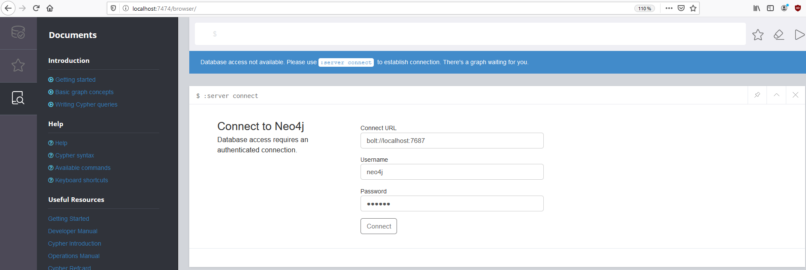
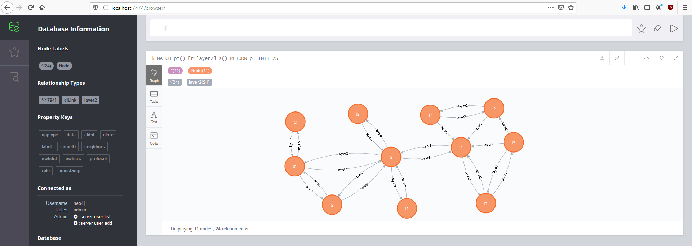
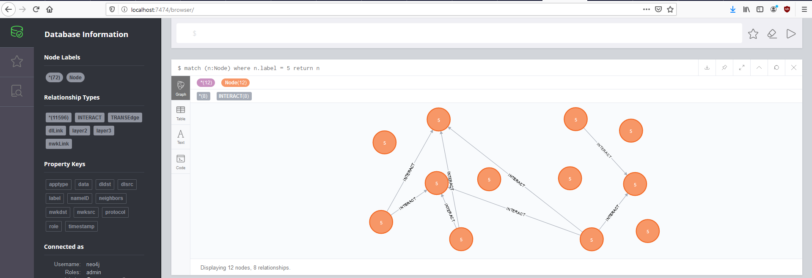

# Getting started

This document is a walkthrough to use IoTMap with an example.

## Requirements :

### Python 3 requirements

* Python > 3.5
* Scapy (pip install scapy or via git using git clone
https://github.com/secdev/scapy.git && cd scapy && python setup.py install)
* neo4j-1.7.6
* docopt-0.6.2
* prompt-toolkit-3.0.5
* terminaltables-3.1.0
* pycryptodomex-3.9.7

You can use the requirements.txt file to install the packages with this command:
```
pip3 install -r requirements.txt
```

### OS libs

* libgcrypt20-dev (for KillerBee)
Depending on the system you used (debian-based OS, archlinux-based OS) you can
use:
```
sudo apt-get install libgcrypt20-dev # (for debian-based distrib)
sudo pacman -S libgcrypt             # (for archlinux-based distrib)
```

## Installation 

This section describes how to install this project. The first thing is to clone
this repo, then install all requirements described above
```
# For any distrib
git clone https://github.com/AlgoSecure/iotmap.git
cd iotmap
sudo pip3 install -r requirements.txt

# If debian-based
sudo apt-get install libgcrypt20-dev

# If archlinux-based
sudo pacman -S libgcrypt
```

Now we gonna install Neo4J. You can install Neo4J from you packet manager if you want. For me, the simplest
way to install and use it is from the tarball. So if like me you choose this
option, you can follow those commands:
```
cd /path/to/iotmap
cd database

# You can replace the version number to the latest one in the URL
wget -O neo4j-community.tar "https://neo4j.com/artifact.php?name=neo4j-community-3.5.9-unix.tar.gz"
mkdir neo4j-community && tar xvf neo4j-community.tar -C neo4j-community --strip-components 1
````

## Configure the database

As explained in the README file, the first thing before using IoTMap is to configure the database to be sure IoTMap can use it. So, we start the database with the following command:
```
./database/neo4j-community/bin/neo4j start
```

After few minutes, the service exposed a web interface accessible through http://localhost:7474. 



Crediantals to login for the first time is neo4j/neo4j, then a new password is requested. To avoid any modifications in the code, i suggest to define **iotmap** as password.

Once this modification is applied, we can run IoTMap.

## First run of IoTMap

Many examples files are provided to start with IoTMap in the **tests** folder. We will use them as demonstration on how to use IoTMap.

### Populate the database

When we run IoTMap, we get starting with the prompt command as following:
```
python3 iotmap.py
Starting the database
Database is available at http://localhost:7474/


IIIIIIIIII              TTTTTTTTTTTTTTTTTTTTTTTMMMMMMMM               MMMMMMMM
I::::::::I              T:::::::::::::::::::::TM:::::::M             M:::::::M
I::::::::I              T:::::::::::::::::::::TM::::::::M           M::::::::M
II::::::II              T:::::TT:::::::TT:::::TM:::::::::M         M:::::::::M
  I::::I     oooooooooooTTTTTT  T:::::T  TTTTTTM::::::::::M       M::::::::::M  aaaaaaaaaaaaa  ppppp   ppppppppp
  I::::I   oo:::::::::::oo      T:::::T        M:::::::::::M     M:::::::::::M  a::::::::::::a p::::ppp:::::::::p
  I::::I  o:::::::::::::::o     T:::::T        M:::::::M::::M   M::::M:::::::M  aaaaaaaaa:::::ap:::::::::::::::::p
  I::::I  o:::::ooooo:::::o     T:::::T        M::::::M M::::M M::::M M::::::M           a::::app::::::ppppp::::::p
  I::::I  o::::o     o::::o     T:::::T        M::::::M  M::::M::::M  M::::::M    aaaaaaa:::::a p:::::p     p:::::p
  I::::I  o::::o     o::::o     T:::::T        M::::::M   M:::::::M   M::::::M  aa::::::::::::a p:::::p     p:::::p
  I::::I  o::::o     o::::o     T:::::T        M::::::M    M:::::M    M::::::M a::::aaaa::::::a p:::::p     p:::::p
  I::::I  o::::o     o::::o     T:::::T        M::::::M     MMMMM     M::::::Ma::::a    a:::::a p:::::p    p::::::p
II::::::IIo:::::ooooo:::::o   TT:::::::TT      M::::::M               M::::::Ma::::a    a:::::a p:::::ppppp:::::::p
I::::::::Io:::::::::::::::o   T:::::::::T      M::::::M               M::::::Ma:::::aaaa::::::a p::::::::::::::::p
I::::::::I oo:::::::::::oo    T:::::::::T      M::::::M               M::::::M a::::::::::aa:::ap::::::::::::::pp
IIIIIIIIII   ooooooooooo      TTTTTTTTTTT      MMMMMMMM               MMMMMMMM  aaaaaaaaaa  aaaap::::::pppppppp
                                                                                                p:::::p
                                                                                                p:::::p
                                                                                               p:::::::p
                                                                                               p:::::::p
                                                                                               p:::::::p
                                                                                               ppppppppp


                                Version=0.1

IoTMap > help

Core commands
=============

 Commands   Description
--------------------------------
 database   Use database mode.
 sniffing   Use sniffing mode.
 exploit    Use exploit mode.
 modelling  Use modelling mode.


IoTMap >
```
As we can wee with the help command, IoTMap has four main modules: **database, sniffing, exploit and modelling**. The exploit and sniffing modules are works in progress and will not be introduce in this walkthrough.

As it is the first run of IoTMap, we need to populate the database to generate a modelling. So we start with the **database** module

```
IoTMap > database
IoTMap database > help

Core commands
=============

 Commands   Description
--------------------------------
 database   Use database mode.
 sniffing   Use sniffing mode.
 exploit    Use exploit mode.
 modelling  Use modelling mode.


Database commands
=================

        Interact with the neo4j database.

List of available commands :
        addNodes
        clearDatabase
        exportDB
        getNodes
        help
        importDB
        importPcaps
        mergeNodes
        removeNode

For more information about any commands hit :
        <command name> -h

IoTMap database > 
```

As we can see many commands are available. We want to populate the database so we can use either the importDB command or the importPCAPS command regarding how we want to populate the database. In this example we will use the **importPCAPS** options. For each command, a help menu is available to explain what the command does and how to use it.

```
IoTMap database > importPcaps -h
Import pcap files into the database

        Usage: importPcaps (<protocol> <pcap>)... [--output <filename>] [--thread <nbThread>] [--nodesFile <nodesFile>]

        Options:
            -h, --help                   Print this message.
            -o, --output <filename>      Output file to store the result.
            -t, --thread <nbThread>      Thread number to use [default: 1].
            -n, --nodesFile <nodesFile>  File that contains a list of nodes used in communications.

        Arguments:
            protocol                   Name of the IoT protocol.
            pcap                       Pcap file from the specific protocol defined in the previous arg.

        Examples:
            import_pcap zigbee file1.pcap zigbee file2.pcap os4i file3.pcap --thread 2 -o zigbee-os4i.csv
            import_pcap btle file1.pcap os4i file3.pcap -t 2 -o btle-os4i.csv
            import_pcap os4i file.pcap --thread 3 --debug --output os4i.csv
IoTMap database > 
```

For this example, we will use importPCAPS with multiple pcaps from three different protocols. Also, a nodes.txt file is provided to define each node used in each PCAP. 

```
IoTMap database > importPcaps btle tests/capture-rpi-tempDispl-test3-merged.pcap btle tests/capture-rpi-rpi-test3.pcap btle tests/capture-rpi-tempSens-test3.pcap zigbee tests/zigbee-test3.pcapng os4i tests/coap-test3.pcapng -o tests/first-run.csv -n tests/nodes.txt -t 2 
```
When the command is ran, it takes some time to convert and populate the database, so go grab a coffee and enjoy =)

After that, the database is populated and we can get some information. For example, we can list the nodes stored in database.

```
IoTMap database > getNodes
 id  dl addresses                                                              nwk addresses
----------------------------------------------------------------------------------------------------------------------------------------------------------------
 0   ['0x0']                                                                   ['0x0']
 1   ['0x7b65']                                                                ['0x7b65']
 2   ['0x3181']                                                                ['0x3181']
 3   ['b8:27:eb:8c:b2:4f', '0xbeef']                                           ['b8:27:eb:8c:b2:4f', '0xbeef']
 4   ['00:12:4b:00:12:04:cb:03', '00:12:4b:00:12:04:cb']                       ['fe80::212:4b00:1204:cb03', 'fe80::212:4b:00:12:04:cb']
 5   ['dc:d0:17:9d:1d:5d']                                                     ['dc:d0:17:9d:1d:5d']
 6   ['b8:27:eb:36:1b:9d', '00:12:4b:00:0e:0d:82', '00:12:4b:00:0e:0d:82:57']  ['b8:27:eb:36:1b:9d', 'bbbb::ba27:ebff:fe9c:b137', '::212:4b00:e0d:8257']
 7   ['e0:14:9e:14:11:72']                                                     ['e0:14:9e:14:11:72']
 8   ['00:12:4b:00:16:65:27:07', '00:12:4b:00:16:65:27']                       ['::212:4b00:1665:2707', 'fe80::212:4b:00:16:65:27']
 9   ['00:12:4b:00:12:77:98:06', '00:12:4b:00:12:77:98']                       ['::212:4b00:1277:9806', 'fe80::212:4b:00:12:77:98']
 10  ['00:12:4b:00:12:04:c9:2d', '00:12:4b:00:12:04:c9']                       ['::212:4b00:1204:c92d', 'fd00::212:4b00:1204:c92d']
 11  ['00:12:4b:00:12:04:ce:a4', '00:12:4b:00:12:04:ce']                       ['::212:4b00:1204:cea4', 'fe80::212:4b:00:12:04:ce', 'fd00::212:4b00:1204:cea4']
IoTMap database > 
```

We can also verify that the import worked correctly by visiting the neo4j webapp hosted at http://localhost:7474



We can see that two relationships have been created and prove that the import was successful. When we import data from pcaps, only the data link graph is created. To model the other graphs we need to use the modelling module.

### Graphs modelling

Now we will model graphs based on the data we previously import. We will use the **modelling** module for the rest of this walkthrough

```
IoTMap database > modelling
IoTMap modelling > help

Core commands
=============

 Commands   Description
--------------------------------
 database   Use database mode.
 sniffing   Use sniffing mode.
 exploit    Use exploit mode.
 modelling  Use modelling mode.


Modelling commands
==================

        Map the network of IoT devices detected by sniffing.

List of available commands :
        appGraph
        compareTo
        dlGraph
        help
        nwkGraph
        option
        run
        set
        transGraph

For more information about any commands hit :
        <command name> -h

IoTMap modelling > option

Module Options (modelling):

 Name     Current Settings  Required  Description
-------------------------------------------------------------------------------------------------------------------------------------
 level    4                 False     Set the number of layers of the graph [default: 4].
 csvFile  None              False     CSV file containing packets converted into unified format.
 tdelta1  0.6               False     Delay for an object to respond to a request. This value is used to build the transport graph.
 tdelta2  0.7               False     Delay for an object to forward a packet. This value is used to build the transport graph.
 adelta   1.5               False     Delay for a controller to forward a packet. This value is used to build the application graph.

IoTMap modelling >  
```

This module comes with different options that can be set with the command **set**. Those options are used as default values to generate graphs.

Regarding what we want to model, we can generate graph step by step using the appropriate function. If we want to only model the network graph, then we use the nwkGraph function and so on. In this example, we will model all the graphs to the application graph. Let's start with the network graph.

```
IoTMap modelling > nwkGraph -h
Generate the network graph of the modelling. If uppers layers have already been generated, this function
        deletes all upper layers.

        Usage: nwkGraph [-h] [--filename filename]

        Options:
            -h, --help               Print this help menu
            -f, --filename filename  File with packets at unified format to generate the graph.
IoTMap modelling >        
```

Then we continue with the other graphs:

```
IoTMap modelling > nwkGraph
IoTMap modelling > transGraph
IoTMap modelling > appGraph
IoTMap modelling >
```

In the case where we already have communications formatted with the unified format, we can use it in the **modelling** module and automate the graphs modelling. With this options, we can skip the intermediate graph generation and go straight to the final graph we want to model.

```
IoTMap modelling > appGraph -f tests/test-all-with-protocol.csv
```

To observe the modelling newly created, we visit http://localhost:7474 

Several relationships have been added on the left side panel, the application graph corresponds to the INTERACT label


If we want to regenerate the application graph with different delta values, we just have to rerun the command with the delta option. The old transmissions will be erased and the new ones will take the place. If we want to modify the delta values of the transport graph, we have to set their value from the **set** command.

```
IoTMap modelling > appGraph -d 100
IoTMap modelling >
```

With this value the graph should be different from the previous one as the delta value changed.


